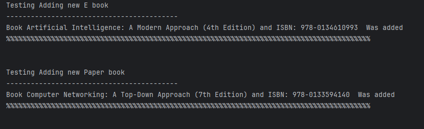
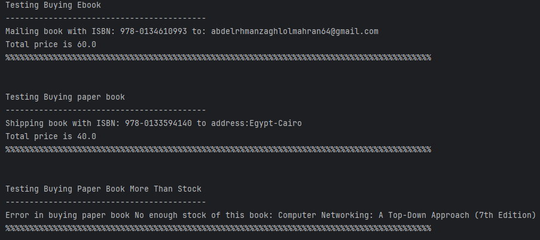
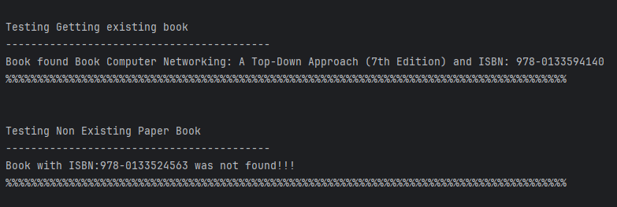
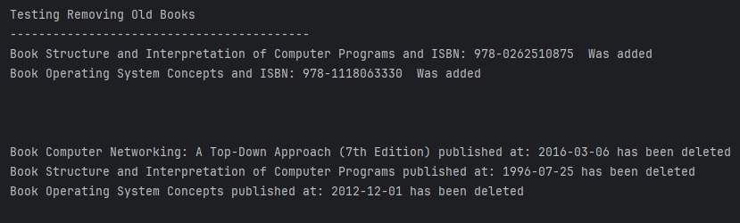

# Quantum Bookstore

A simple Java-based bookstore management system supporting both paper books and eBooks. This project demonstrates object-oriented programming concepts, interfaces, and basic inventory operations.

---

## Overview
Quantum Bookstore is a console-based application for managing a collection of books, supporting both physical (paper) and digital (eBook) formats. It allows adding, searching, buying, and removing books, and demonstrates the use of Java interfaces and inheritance.

## Features
- Add new paper books and eBooks to the store
- Search for books by ISBN
- Buy paper books (with stock management and shipping simulation)
- Buy eBooks (with email delivery simulation)
- Remove books older than a specified number of years
- Demonstrates OOP principles: inheritance, interfaces, and polymorphism

## Screenshots

### Adding Books

### Buying Books

### Searching For Books

### Removing Old Books

